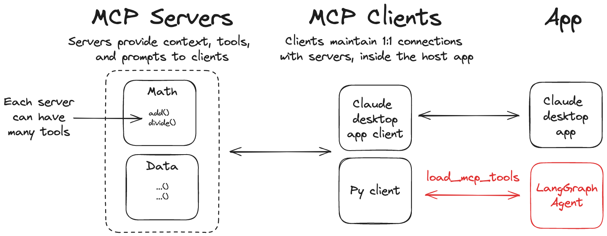

# LangChain MCP Adapters

This library provides a lightweight wrapper that makes [Anthropic Model Context Protocol (MCP)](https://modelcontextprotocol.io/introduction) tools compatible with [LangChain](https://github.com/langchain-ai/langchain) and [LangGraph](https://github.com/langchain-ai/langgraph).



> [!note]
> A JavaScript/TypeScript version of this library is also available at [langchainjs](https://github.com/langchain-ai/langchainjs/tree/main/libs/langchain-mcp-adapters/).

## Features

- 🛠️ Convert MCP tools into [LangChain tools](https://python.langchain.com/docs/concepts/tools/) that can be used with [LangGraph](https://github.com/langchain-ai/langgraph) agents
- 📦 A client implementation that allows you to connect to multiple MCP servers and load tools from them
- 📝 MCP **prompts/list** and **prompts/get**: `MultiServerMCPClient.list_prompts()` discovers prompt templates (metadata); `get_prompt()` loads rendered messages for a chosen template (same split as the [MCP Inspector](https://www.npmjs.com/package/@modelcontextprotocol/inspector) flow)
- 🔗 **`bind_mcp_prompt`**: compose MCP prompt messages with a chat model in one runnable (same idea as `model.bind_tools(tools)` — prepend template content, then invoke the model); see [`langchain_mcp_adapters.prompt_binder`](langchain_mcp_adapters/prompt_binder.py)
- **`create_mcp_prompt_injection_node`**: LangGraph-only node that writes MCP prompt messages into state (`prepend` / `append`); see [`langchain_mcp_adapters.langgraph_prompt`](langchain_mcp_adapters/langgraph_prompt.py)

## Installation

```bash
pip install langchain-mcp-adapters
```

## Quickstart

Here is a simple example of using the MCP tools with a LangGraph agent.

```bash
pip install langchain-mcp-adapters langgraph "langchain[openai]"

export OPENAI_API_KEY=<your_api_key>
```

### Server

First, let's create an MCP server that can add and multiply numbers.

```python
# math_server.py
from mcp.server.fastmcp import FastMCP

mcp = FastMCP("Math")

@mcp.tool()
def add(a: int, b: int) -> int:
    """Add two numbers"""
    return a + b

@mcp.tool()
def multiply(a: int, b: int) -> int:
    """Multiply two numbers"""
    return a * b

if __name__ == "__main__":
    mcp.run(transport="stdio")
```

### Client

```python
# Create server parameters for stdio connection
from mcp import ClientSession, StdioServerParameters
from mcp.client.stdio import stdio_client

from langchain_mcp_adapters.tools import load_mcp_tools
from langchain.agents import create_agent

server_params = StdioServerParameters(
    command="python",
    # Make sure to update to the full absolute path to your math_server.py file
    args=["/path/to/math_server.py"],
)

async with stdio_client(server_params) as (read, write):
    async with ClientSession(read, write) as session:
        # Initialize the connection
        await session.initialize()

        # Get tools
        tools = await load_mcp_tools(session)

        # Create and run the agent
        agent = create_agent("openai:gpt-4.1", tools)
        agent_response = await agent.ainvoke({"messages": "what's (3 + 5) x 12?"})
```

## Multiple MCP Servers

The library also allows you to connect to multiple MCP servers and load tools from them:

### Server

```python
# math_server.py
...

# weather_server.py
from typing import List
from mcp.server.fastmcp import FastMCP

mcp = FastMCP("Weather")

@mcp.tool()
async def get_weather(location: str) -> str:
    """Get weather for location."""
    return "It's always sunny in New York"

if __name__ == "__main__":
    mcp.run(transport="http")
```

```bash
python weather_server.py
```

### Client

```python
from langchain_mcp_adapters.client import MultiServerMCPClient
from langchain.agents import create_agent

client = MultiServerMCPClient(
    {
        "math": {
            "command": "python",
            # Make sure to update to the full absolute path to your math_server.py file
            "args": ["/path/to/math_server.py"],
            "transport": "stdio",
        },
        "weather": {
            # Make sure you start your weather server on port 8000
            "url": "http://localhost:8000/mcp",
            "transport": "http",
        }
    }
)
tools = await client.get_tools()
agent = create_agent("openai:gpt-4.1", tools)
math_response = await agent.ainvoke({"messages": "what's (3 + 5) x 12?"})
weather_response = await agent.ainvoke({"messages": "what is the weather in nyc?"})
```

> [!note]
> Example above will start a new MCP `ClientSession` for each tool invocation. If you would like to explicitly start a session for a given server, you can do:
>
> ```python
> from langchain_mcp_adapters.tools import load_mcp_tools
>
> client = MultiServerMCPClient({...})
> async with client.session("math") as session:
>     tools = await load_mcp_tools(session)
> ```

## Streamable HTTP

MCP now supports [streamable HTTP](https://modelcontextprotocol.io/specification/2025-03-26/basic/transports#streamable-http) transport.

To start an [example](examples/servers/streamable-http-stateless/) streamable HTTP server, run the following:

```bash
cd examples/servers/streamable-http-stateless/
uv run mcp-simple-streamablehttp-stateless --port 3000
```

Alternatively, you can use FastMCP directly (as in the examples above).

To use it with Python MCP SDK `streamablehttp_client`:

```python
# Use server from examples/servers/streamable-http-stateless/

from mcp import ClientSession
from mcp.client.streamable_http import streamablehttp_client

from langchain.agents import create_agent
from langchain_mcp_adapters.tools import load_mcp_tools

async with streamablehttp_client("http://localhost:3000/mcp") as (read, write, _):
    async with ClientSession(read, write) as session:
        # Initialize the connection
        await session.initialize()

        # Get tools
        tools = await load_mcp_tools(session)
        agent = create_agent("openai:gpt-4.1", tools)
        math_response = await agent.ainvoke({"messages": "what's (3 + 5) x 12?"})
```

Use it with `MultiServerMCPClient`:

```python
# Use server from examples/servers/streamable-http-stateless/
from langchain_mcp_adapters.client import MultiServerMCPClient
from langchain.agents import create_agent

client = MultiServerMCPClient(
    {
        "math": {
            "transport": "http",
            "url": "http://localhost:3000/mcp"
        },
    }
)
tools = await client.get_tools()
agent = create_agent("openai:gpt-4.1", tools)
math_response = await agent.ainvoke({"messages": "what's (3 + 5) x 12?"})
```

## Passing runtime headers

When connecting to MCP servers, you can include custom headers (e.g., for authentication or tracing) using the `headers` field in the connection configuration. This is supported for the following transports:

- `sse`
- `http` (or `streamable_http`)

### Example: passing headers with `MultiServerMCPClient`

```python
from langchain_mcp_adapters.client import MultiServerMCPClient
from langchain.agents import create_agent

client = MultiServerMCPClient(
    {
        "weather": {
            "transport": "http",
            "url": "http://localhost:8000/mcp",
            "headers": {
                "Authorization": "Bearer YOUR_TOKEN",
                "X-Custom-Header": "custom-value"
            },
        }
    }
)
tools = await client.get_tools()
agent = create_agent("openai:gpt-4.1", tools)
response = await agent.ainvoke({"messages": "what is the weather in nyc?"})
```

> Only `sse` and `http` transports support runtime headers. These headers are passed with every HTTP request to the MCP server.

## Using with LangGraph StateGraph

```python
from langchain_mcp_adapters.client import MultiServerMCPClient
from langgraph.graph import StateGraph, MessagesState, START
from langgraph.prebuilt import ToolNode, tools_condition

from langchain.chat_models import init_chat_model
model = init_chat_model("openai:gpt-4.1")

client = MultiServerMCPClient(
    {
        "math": {
            "command": "python",
            # Make sure to update to the full absolute path to your math_server.py file
            "args": ["./examples/math_server.py"],
            "transport": "stdio",
        },
        "weather": {
            # make sure you start your weather server on port 8000
            "url": "http://localhost:8000/mcp",
            "transport": "http",
        }
    }
)
tools = await client.get_tools()

def call_model(state: MessagesState):
    response = model.bind_tools(tools).invoke(state["messages"])
    return {"messages": response}

builder = StateGraph(MessagesState)
builder.add_node(call_model)
builder.add_node(ToolNode(tools))
builder.add_edge(START, "call_model")
builder.add_conditional_edges(
    "call_model",
    tools_condition,
)
builder.add_edge("tools", "call_model")
graph = builder.compile()
math_response = await graph.ainvoke({"messages": "what's (3 + 5) x 12?"})
weather_response = await graph.ainvoke({"messages": "what is the weather in nyc?"})
```

## MCP prompts and `bind_mcp_prompt`

MCP does not define a `bind_prompt` on the LLM; prompts are messages from **`prompts/get`**. Use **`bind_mcp_prompt`** to prepend those messages, then call the model (same chaining idea as **`bind_tools`** + **`ToolNode`** for tools):

```python
from langchain_mcp_adapters.client import MultiServerMCPClient
from langchain_mcp_adapters.prompt_binder import bind_mcp_prompt
from langchain.chat_models import init_chat_model

client = MultiServerMCPClient({...})
model = init_chat_model("openai:gpt-4.1")

bound = bind_mcp_prompt(
    model,
    client=client,
    server_name="math",
    prompt_name="configure_assistant",
    arguments={"skills": "arithmetic"},
)
# Prefer ainvoke: MCP client I/O is async
reply = await bound.ainvoke("What is 7 * 8?")
```

For LangGraph state with extra fields, pass **`arguments_resolver=lambda state: {...}`** so template arguments can depend on `state`.

## MCP prompt injection node (LangGraph)

To update only the graph state (like **`ToolNode`** updates messages with tool results), use **`create_mcp_prompt_injection_node`**: it calls **`prompts/get`** and returns a **`messages`** update for **`add_messages`** / **`MessagesState`**.

- **`placement="prepend"`** (default): MCP messages appear **before** the current history (LangGraph **`RemoveMessage(REMOVE_ALL_MESSAGES)`** + full list pattern).
- **`placement="append"`**: MCP messages are **appended** after existing messages.

```python
from langgraph.graph import END, MessagesState, START, StateGraph

from langchain_mcp_adapters.client import MultiServerMCPClient
from langchain_mcp_adapters.langgraph_prompt import create_mcp_prompt_injection_node

client = MultiServerMCPClient({...})
inject = create_mcp_prompt_injection_node(
    client,
    "math",
    "configure_assistant",
    arguments={"skills": "algebra"},
)

builder = StateGraph(MessagesState)
builder.add_node("mcp_prompt", inject)
builder.add_edge(START, "mcp_prompt")
# builder.add_edge("mcp_prompt", "agent")  # then your model node
```

Requires **`langgraph`** (declared in the library’s **test** dependency group for contributors; install in your app with `pip install langgraph`).

## Using with LangGraph API Server

> [!TIP]
> Check out [this guide](https://langchain-ai.github.io/langgraph/tutorials/langgraph-platform/local-server/) on getting started with LangGraph API server.

If you want to run a LangGraph agent that uses MCP tools in a LangGraph API server, you can use the following setup:

```python
# graph.py
from contextlib import asynccontextmanager
from langchain_mcp_adapters.client import MultiServerMCPClient
from langchain.agents import create_agent

async def make_graph():
    client = MultiServerMCPClient(
        {
            "weather": {
                # make sure you start your weather server on port 8000
                "url": "http://localhost:8000/mcp",
                "transport": "http",
            },
            # ATTENTION: MCP's stdio transport was designed primarily to support applications running on a user's machine.
            # Before using stdio in a web server context, evaluate whether there's a more appropriate solution.
            # For example, do you actually need MCP? or can you get away with a simple `@tool`?
            "math": {
                "command": "python",
                # Make sure to update to the full absolute path to your math_server.py file
                "args": ["/path/to/math_server.py"],
                "transport": "stdio",
            },
        }
    )
    tools = await client.get_tools()
    agent = create_agent("openai:gpt-4.1", tools)
    return agent
```

In your [`langgraph.json`](https://langchain-ai.github.io/langgraph/cloud/reference/cli/#configuration-file) make sure to specify `make_graph` as your graph entrypoint:

```json
{
  "dependencies": ["."],
  "graphs": {
    "agent": "./graph.py:make_graph"
  }
}
```
