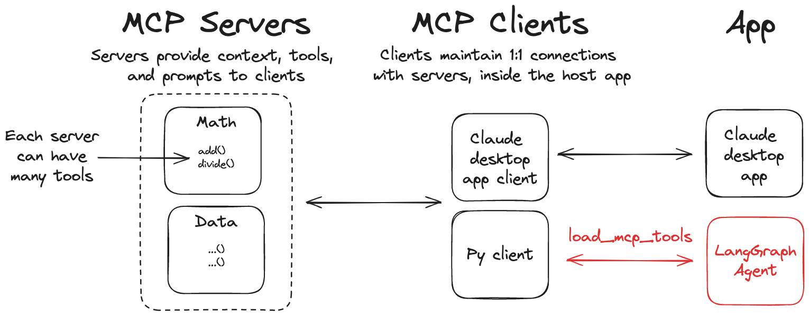

# LangChain MCP Adapters

This library provides a lightweight wrapper that makes [Anthropic Model Context Protocol (MCP)](https://modelcontextprotocol.io/introduction) tools compatible with [LangChain](https://github.com/langchain-ai/langchain) and [LangGraph](https://github.com/langchain-ai/langgraph).



> [!note]
> A JavaScript/TypeScript version of this library is also available at [langchainjs](https://github.com/langchain-ai/langchainjs/tree/main/libs/langchain-mcp-adapters/).

## Features

- 🛠️ Convert MCP tools into [LangChain tools](https://python.langchain.com/docs/concepts/tools/) that can be used with [LangGraph](https://github.com/langchain-ai/langgraph) agents
- 📦 A client implementation that allows you to connect to multiple MCP servers and load tools from them

## Installation

```bash
pip install langchain-mcp-adapters
```

## Quickstart

Here is a simple example of using the MCP tools with a LangGraph agent.

```bash
pip install langchain-mcp-adapters langgraph "langchain[openai]"

export OPENAI_API_KEY=<your_api_key>
```

### Server

First, let's create an MCP server that can add and multiply numbers.

```python
# math_server.py
from mcp.server.fastmcp import FastMCP

mcp = FastMCP("Math")

@mcp.tool()
def add(a: int, b: int) -> int:
    """Add two numbers"""
    return a + b

@mcp.tool()
def multiply(a: int, b: int) -> int:
    """Multiply two numbers"""
    return a * b

if __name__ == "__main__":
    mcp.run(transport="stdio")
```

### Client

```python
# Create server parameters for stdio connection
from mcp import ClientSession, StdioServerParameters
from mcp.client.stdio import stdio_client

from langchain_mcp_adapters.sessions import negotiate_protocol
from langchain_mcp_adapters.tools import load_mcp_tools
from langchain.agents import create_agent

server_params = StdioServerParameters(
    command="python",
    # Make sure to update to the full absolute path to your math_server.py file
    args=["/path/to/math_server.py"],
)

async with stdio_client(server_params) as (read, write):
    async with ClientSession(read, write) as session:
        # Negotiate the protocol revision. Prefer this over `session.initialize()`:
        # `initialize` is the handshake-era path and can never reach MCP 2026-07-28.
        await negotiate_protocol(session)

        # Get tools
        tools = await load_mcp_tools(session)

        # Create and run the agent
        agent = create_agent("openai:gpt-4.1", tools)
        agent_response = await agent.ainvoke({"messages": "what's (3 + 5) x 12?"})
```

## Multiple MCP Servers

The library also allows you to connect to multiple MCP servers and load tools from them:

### Server

```python
# math_server.py
...

# weather_server.py
from typing import List
from mcp.server.fastmcp import FastMCP

mcp = FastMCP("Weather")

@mcp.tool()
async def get_weather(location: str) -> str:
    """Get weather for location."""
    return "It's always sunny in New York"

if __name__ == "__main__":
    mcp.run(transport="http")
```

```bash
python weather_server.py
```

### Client

```python
from langchain_mcp_adapters.client import MultiServerMCPClient
from langchain.agents import create_agent

client = MultiServerMCPClient(
    {
        "math": {
            "command": "python",
            # Make sure to update to the full absolute path to your math_server.py file
            "args": ["/path/to/math_server.py"],
            "transport": "stdio",
        },
        "weather": {
            # Make sure you start your weather server on port 8000
            "url": "http://localhost:8000/mcp",
            "transport": "http",
        }
    }
)
tools = await client.get_tools()
agent = create_agent("openai:gpt-4.1", tools)
math_response = await agent.ainvoke({"messages": "what's (3 + 5) x 12?"})
weather_response = await agent.ainvoke({"messages": "what is the weather in nyc?"})
```

> [!note]
> Example above will start a new MCP `ClientSession` for each tool invocation. If you would like to explicitly start a session for a given server, you can do:
>
> ```python
> from langchain_mcp_adapters.tools import load_mcp_tools
>
> client = MultiServerMCPClient({...})
> async with client.session("math") as session:
>     tools = await load_mcp_tools(session)
> ```

## Streamable HTTP

MCP now supports [streamable HTTP](https://modelcontextprotocol.io/specification/2025-03-26/basic/transports#streamable-http) transport.

To start an [example](examples/servers/streamable-http-stateless/) streamable HTTP server, run the following:

```bash
cd examples/servers/streamable-http-stateless/
uv run mcp-simple-streamablehttp-stateless --port 3000
```

Alternatively, you can use FastMCP directly (as in the examples above).

To use it with Python MCP SDK `streamablehttp_client`:

```python
# Use server from examples/servers/streamable-http-stateless/

from mcp import ClientSession
from mcp.client.streamable_http import streamable_http_client

from langchain.agents import create_agent
from langchain_mcp_adapters.sessions import negotiate_protocol
from langchain_mcp_adapters.tools import load_mcp_tools

async with streamable_http_client("http://localhost:3000/mcp") as (read, write):
    async with ClientSession(read, write) as session:
        # Negotiate the protocol revision (see "Protocol versions" below).
        await negotiate_protocol(session)

        # Get tools
        tools = await load_mcp_tools(session)
        agent = create_agent("openai:gpt-4.1", tools)
        math_response = await agent.ainvoke({"messages": "what's (3 + 5) x 12?"})
```

Use it with `MultiServerMCPClient`:

```python
# Use server from examples/servers/streamable-http-stateless/
from langchain_mcp_adapters.client import MultiServerMCPClient
from langchain.agents import create_agent

client = MultiServerMCPClient(
    {
        "math": {
            "transport": "http",
            "url": "http://localhost:3000/mcp"
        },
    }
)
tools = await client.get_tools()
agent = create_agent("openai:gpt-4.1", tools)
math_response = await agent.ainvoke({"messages": "what's (3 + 5) x 12?"})
```

## Passing runtime headers

When connecting to MCP servers, you can include custom headers (e.g., for authentication or tracing) using the `headers` field in the connection configuration. This is supported for the following transports:

- `sse`
- `http` (or `streamable_http`)

### Example: passing headers with `MultiServerMCPClient`

```python
from langchain_mcp_adapters.client import MultiServerMCPClient
from langchain.agents import create_agent

client = MultiServerMCPClient(
    {
        "weather": {
            "transport": "http",
            "url": "http://localhost:8000/mcp",
            "headers": {
                "Authorization": "Bearer YOUR_TOKEN",
                "X-Custom-Header": "custom-value"
            },
        }
    }
)
tools = await client.get_tools()
agent = create_agent("openai:gpt-4.1", tools)
response = await agent.ainvoke({"messages": "what is the weather in nyc?"})
```

> Only `sse` and `http` transports support runtime headers. These headers are passed with every HTTP request to the MCP server.

## Protocol versions

MCP has two negotiation eras. Everything up to `2025-11-25` is reached through
the `initialize` handshake. `2026-07-28` is not: it is reached through a
`server/discover` probe, and drops server-to-client requests in favor of a
stateless per-request envelope.

By default the adapter negotiates `"auto"` — it probes for `2026-07-28` and
falls back to the handshake for servers that predate it. Set `protocol` to
change that, either per connection or for the whole client:

```python
client = MultiServerMCPClient(
    {
        # Inherits the client-wide default below.
        "weather": {"url": "http://localhost:8000/mcp", "transport": "http"},
        # Requires 2026-07-28; no probe, no fallback.
        "docs": {
            "url": "http://localhost:8001/mcp",
            "transport": "http",
            "protocol": "2026-07-28",
        },
        # Pinned to the handshake era.
        "legacy-server": {
            "url": "http://localhost:8002/mcp",
            "transport": "http",
            "protocol": "legacy",
        },
    },
    protocol="auto",  # client-wide default; a connection's own key wins
)

info = await client.get_server_info()
print(info["weather"].protocol_version)  # e.g. "2026-07-28"
```

| Value | Behavior |
| --- | --- |
| `"auto"` (default) | Probe `server/discover`, fall back to `initialize`. The only value that can reach `2026-07-28`. |
| `"legacy"` | Force the `initialize` handshake. Never probes. |
| `"2026-07-28"` | Adopt that revision directly, without probing. |

### What changes at 2026-07-28

- **Elicitation and sampling no longer use a back-channel.** The server returns
  an `InputRequiredResult` and the adapter answers it through your existing
  `Callbacks`, so `on_elicitation` behaves the same on either era.
- **A server that calls `ctx.elicit()` directly inside a tool body cannot
  elicit.** That path needs a server-to-client request, which the revision
  removes. Such servers need to move to resolver-based elicitation
  (`Annotated[T, Resolve(fn)]` returning `Elicit(...)`), or the client can pin
  `protocol="legacy"`.
- **Logging is opt-in.** Servers only emit log messages for requests that ask
  for them. The adapter opts in automatically whenever
  `Callbacks.on_logging_message` is set; narrow it with `Callbacks.log_level`.
- **`resources/subscribe` and `ping` are gone**, and client-to-server progress
  is deprecated. Server-to-client progress is unaffected.

## Human-in-the-loop elicitation

When an MCP server needs input mid-call, `elicitation="interrupt"` surfaces it
as a LangGraph [interrupt](https://langchain-ai.github.io/langgraph/how-tos/human_in_the_loop/add-human-in-the-loop/)
so a person can answer, instead of answering it inline from a callback.

```python
client = MultiServerMCPClient(
    {"profiles": {"url": "http://localhost:8000/mcp", "transport": "http"}},
    elicitation="interrupt",
)
tools = await client.get_tools()

# ... inside a graph node ...
result = await tools[0].ainvoke({"args": {"name": "Alice"}, "id": "1", "type": "tool_call"})
```

The graph suspends with a JSON payload describing what was asked:

```python
paused = await app.ainvoke({}, config)
paused["__interrupt__"][0].value
# {
#   "type": "mcp_input_required",
#   "server": "profiles",
#   "tool": "create_profile",
#   "requests": {
#     "<key>": {
#       "kind": "elicit",
#       "mode": "form",
#       "message": "Please provide details for Alice's profile:",
#       "requested_schema": {"type": "object", "properties": {...}},
#     }
#   },
# }
```

Resume with the answer. A single question can be answered directly; several are
answered with a mapping keyed by request key. `"decline"` and `"cancel"` are
accepted as-is.

```python
await app.ainvoke(Command(resume={"email": "alice@example.com", "age": 28}), config)
```

### Why this needs 2026-07-28

On a handshake-era connection, elicitation is a request the server sends *during*
the tool call and then blocks on. Suspending the graph would tear down the
connection it is waiting on, and there would be nothing to resume against — so
that combination is refused with an explanation rather than silently breaking.

At 2026-07-28 the call *completes* and returns the questions along with an
opaque `request_state` token. The connection can close, the graph can stay
suspended for as long as a human takes, and the call is re-issued against a
brand new session on resume.

Each round is memoized as a LangGraph [task][langgraph.func.task], so resuming
replays the first round from the checkpoint rather than re-asking the server. A
tool that elicits once costs two round-trips, not three.

> `request_state` is minted and sealed by the server and is subject to its TTL
> and signing-key lifetime. A server using the default process-local key will
> reject a token that outlives its own restart, however long the graph held it.

Callback-based elicitation (`Callbacks(on_elicitation=...)`) remains the
default and works on every revision.

## Tool error handling

MCP distinguishes a tool *execution* error (`CallToolResult(isError=True)`, e.g. "project not found") from a protocol/transport failure. By default, an execution error is returned to the model as a `ToolMessage` with `status="error"`, so the agent can see what went wrong and self-correct instead of the run crashing:

```python
client = MultiServerMCPClient({...})
tools = await client.get_tools()  # handle_tool_errors=True by default
```

To restore the legacy behavior — raising a `ToolException` on execution errors — set `handle_tool_errors=False`:

```python
client = MultiServerMCPClient({...}, handle_tool_errors=False)
# or, at the tool-loading level:
tools = await load_mcp_tools(session, handle_tool_errors=False)
```

> The error's content blocks are preserved verbatim on the `ToolMessage`. The one exception: if the MCP error has no content at all, a minimal placeholder text block is substituted so the tool message isn't empty (a fragile shape for some model providers) — this placeholder is adapter-generated, not server-provided error detail.
>
> Transport/session failures and content-conversion errors (e.g. unsupported audio content) always raise regardless of this setting; only MCP execution errors (`isError=True`) are governed by it.

## Using with LangGraph StateGraph

```python
from langchain_mcp_adapters.client import MultiServerMCPClient
from langgraph.graph import StateGraph, MessagesState, START
from langgraph.prebuilt import ToolNode, tools_condition

from langchain.chat_models import init_chat_model
model = init_chat_model("openai:gpt-4.1")

client = MultiServerMCPClient(
    {
        "math": {
            "command": "python",
            # Make sure to update to the full absolute path to your math_server.py file
            "args": ["./examples/math_server.py"],
            "transport": "stdio",
        },
        "weather": {
            # make sure you start your weather server on port 8000
            "url": "http://localhost:8000/mcp",
            "transport": "http",
        }
    }
)
tools = await client.get_tools()

def call_model(state: MessagesState):
    response = model.bind_tools(tools).invoke(state["messages"])
    return {"messages": response}

builder = StateGraph(MessagesState)
builder.add_node(call_model)
builder.add_node(ToolNode(tools))
builder.add_edge(START, "call_model")
builder.add_conditional_edges(
    "call_model",
    tools_condition,
)
builder.add_edge("tools", "call_model")
graph = builder.compile()
math_response = await graph.ainvoke({"messages": "what's (3 + 5) x 12?"})
weather_response = await graph.ainvoke({"messages": "what is the weather in nyc?"})
```

## Using with LangGraph API Server

> [!TIP]
> Check out [this guide](https://langchain-ai.github.io/langgraph/tutorials/langgraph-platform/local-server/) on getting started with LangGraph API server.

If you want to run a LangGraph agent that uses MCP tools in a LangGraph API server, you can use the following setup:

```python
# graph.py
from contextlib import asynccontextmanager
from langchain_mcp_adapters.client import MultiServerMCPClient
from langchain.agents import create_agent

async def make_graph():
    client = MultiServerMCPClient(
        {
            "weather": {
                # make sure you start your weather server on port 8000
                "url": "http://localhost:8000/mcp",
                "transport": "http",
            },
            # ATTENTION: MCP's stdio transport was designed primarily to support applications running on a user's machine.
            # Before using stdio in a web server context, evaluate whether there's a more appropriate solution.
            # For example, do you actually need MCP? or can you get away with a simple `@tool`?
            "math": {
                "command": "python",
                # Make sure to update to the full absolute path to your math_server.py file
                "args": ["/path/to/math_server.py"],
                "transport": "stdio",
            },
        }
    )
    tools = await client.get_tools()
    agent = create_agent("openai:gpt-4.1", tools)
    return agent
```

In your [`langgraph.json`](https://langchain-ai.github.io/langgraph/cloud/reference/cli/#configuration-file) make sure to specify `make_graph` as your graph entrypoint:

```json
{
  "dependencies": ["."],
  "graphs": {
    "agent": "./graph.py:make_graph"
  }
}
```
